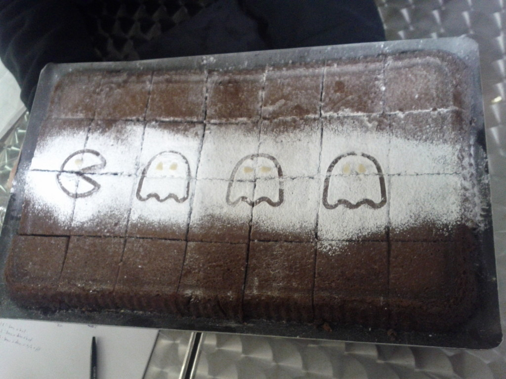

Salut les gens ! **J’ai participé à la Global Game Jam !** Après deux ans en tant que spectateur, je me suis décidé à participer cette année. La première fois que nous y sommes allés (en tant que JeuxAmateurs.fr), nous avons rencontré l’association qui nous a permis de participer au Stunfest ces deux dernières années. En gros, **c’est grâce à cet événement que nous avons pu rencontrer beaucoup d’acteurs du jeu indépendant et de l’amateur sur Rennes**.

Pour en revenir à l’événement en lui-même, cela se déroulait sur le week-end du 25 au 27 janvier 2013. Le vendredi soir, après notre périple en bus, nous sommes finalement arrivé ! Les présentations commencèrent et **le thème fut annoncé,** _un battement de coeur_ que voici :

<YouTube videoId="h_lTq6XL-AE" />

La réflexion commença autour de ça. Les idées fusaient (ou pas parfois) et nous sommes partis sur une idée de Twister sur clavier. L’idée paraissait sympathique au premier abord mais elle s’est vite révéler difficile à mettre en place. Un peu avant de faire un point général des projets vers 0h00, nous n’avions toujours pas d’idée précise et tout le monde avait l’air d’être affairé à la préparation de leur projet. On est donc parti sur une idée plus classique, **un runner avec une dimension rythmique**. J’avais au départ prévu de ne pas me mettre avec Brindesable pour rencontrer de nouveaux gens et façons de programmer. Mais au final avec la profusion de technologies comme HTML5/Js ou Unity3D, je me sentais vieux jeu avec mon **C++** et ma **SFML**. On s’est donc lancé à deux comme dans notre bonne vieille équipe **SwitchCode**. Mais nous n’avions pas de graphiste. J’aurai pu m’improviser graphiste mais sans tablette graphique et sans bon logiciel il m’aurait été difficile de faire rapidement de bons sprites. Mais heureusement, **Rémy alias Capitaine Frites nous a rejoint pour faire des modèles 3D** qui servent de sprites. On s’est donc lancé dans l’aventure du code !

**Je me suis chargé de la partie rythmique qui consiste à battre la mesure en fonction des battements de cœur du personnage**. Kilian s’est chargé du runner. Le projet s’est construit petit à petit sans grand problème sauf le samedi où Git, notre système de versionnement ne voulait plus uploader sur GitHub. J’ai uploadé le reste si certains veulent jeter un œil au code. Avec 10h de sommeil dans le week-end, nous n’avons pas dormi tant que ça et arrivés au dernier jour, bien crevés, on a fait le rush de dernière minute, vous savez, ce moment où vous vous dites “_Viiiiite il reste que 5 minutes pour faire tout ça !_“. Pour terminer, il y a eu une présentation retransmise en stream et donc enregistrée, vous pouvez la retrouver ici.

Le jeu est disponible sur [GlobalGameJam.org](http://globalgamejam.org/2013/heart-jump "Heart of Jump sur Global Game Jam") si vous voulez. N’hésitez pas non plus à donner des retours. Avec Rémy, on est pour une **suite/évolution du projet** (et pourquoi pas sur mobile, hein ?).

**J’ai passé un bon moment à cette Global, on a bien mangé pour pas cher, la musique était bien (je sais pas comment tu t’appelles mais t’avais des bons goûts / CDs) et si j’en ai l’occasion, je la referai bien l’année prochaine !**

