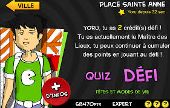

Salut les gens ! Aujourd’hui c’est un jeu qui m’amène parmi vous, **un jeu sur la ville de Rennes** : les mystères de Rennes développé par **Regards** avec le **soutien du musée de Bretagne et des Champs Libres**.

C’est avec la com’ faite autour du jeu, des flyers plus précisément, que je m’y suis intéressé mais sans m’y inscrire tout de suite. Quelques jours plus tard, c’est un ami rennais qui m’envoie le lien pour que j’y jette un œil. Je décide donc d’aller m’inscrire.

Un rapide coup d’œil et je m’aperçois que **c’est plutôt agréable niveau graphisme**, je trifouille rapidement le code, **tout en Javascript sur une page HTML5, assez nice** ! Niveau jeu, on se lance dans un des quatre lieux de Rennes, je commence donc par Saint Anne (parce que faut bien commencer quelque part et que c’est le premier venu). Ainsi j’arrive en face d’un mec qui me dit qu’**il faut que je gagne des crédits Défi en faisant des Quizz**.

Je me lance donc dans l’aventure et me voici en train de mémoriser différentes anecdotes sur la ville de Rennes. Ensuite, il faut atteindre 10 points en un temps limité. Deux choix s’offrent à nous, **taper directement la réponse** et gagner 3 points ou la choisir entre 3 réponses _façon Qui Veut Gagner Des Millions mais sans Jean-Pierre Foucault_. Ça y est, j’ai récupéré 1 crédit Défi, je peux donc **affronter le maître du lieu, autrement dit la personne qui est passée avant moi et qui a fait le meilleur score**. Je regarde vite fait la grande image qui s’affiche devant moi et je saute à pieds joints dans l’inconnu. **Différents objets ont été masqués et à moi de retrouver celui qui est annoncé pour afficher une question à laquelle je dois répondre.** Et le tout se répète jusqu’à temps que le temps soit fini ou qu’il n’y ait plus d’images à trouver. Fier de moi, je clique sur les images et je réponds à peu près aux questions. La fin arrive, j’ai entre 600 et 1000 points (ça date excusez-moi), génial, il ne me reste que 20 000 points qui me séparent du maître du lieu (et encore, ça c’était à mes débuts).

**Voilà maintenant quelques jours que je suis accroché à ce jeu**, je suis actuellement 17ème dans le total cumulé, mais ça risque de bouger encore. J’ai été maître du lieu une fois, pendant 3h… Et ça va continuer, **jusqu’au 15 mars** ! Rejoignez la bataille, on est 2500 et déjà plus !

Avant de partir, juste pour l’anecdote, juste avant que le jeu soit en maintenance, j’ai fait ce score (véridique, loin de moi l’idée d’afficher un faux score). Alors je ne sais pas si c’est la maintenance qui m’a permis de faire un score énorme et/ou si elle a provoqué la non-sauvegarde de mon score :(. Mais bon, j’en veux pas au jeu, le principal c’est de s’amuser ;).

 
