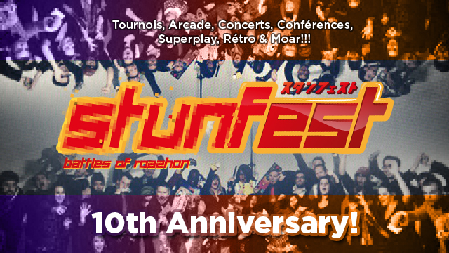

Le Stunfest, c'est dans 100 jours ! Si si, regardez là : [Compteur Stunfest](http://stunfest.yorunohikage.fr "Un super compteur avec une super musique !").

Qu'en dire si ce n'est que c'est un super festival auquel je participe chaque année en visiteur mais aussi parfois en exposant.

## Petits rappels des précédentes années.

Mon Premier Stunfest : édition 2011. C'est avec la rencontre d'Aymeric Lesné (président de l'association 3 Hit Combo) lors de la Global Game Jam 2011 que nous (moi, Kilian a.k.a. [@Brindesable](http://twitter.com/Brindesable "Twitter de Brindesable") et Mathieu a.k.a. Teroox) avons entendu parler du Stunfest qui rassemblait beaucoup de joueurs chaque année.

<iframe style="margin: auto; display: block;" width="560" height="315" src="https://www.dailymotion.com/embed/video/xgtwox" frameborder="0" allowfullscreen></iframe>

En nous proposant de venir exposer en tant que JeuxAmateurs (une archive du site ici : [Old JeuxAmateurs](http://old.jeuxamateurs.fr "Archive de JeuxAmateurs")), nous avons été agréablement surpris de la confiance de ce dernier. Grâce à lui, nous avons fait la connaissance directe de [@Valryon](http://twitter.com/Valryon "Twitter de Valryon") & co qui exposait juste à côté de nous pour leur jeu amateur / indépendant : [The Great Paper Adventure](http://thegreatpaperadventure.com "The Great Paper Adventure, un Great jeu !").

Le Stunfest de l'année suivante a vu l'apparition du [West Indie Collective](http://westindiecollective.org "West Indie Collective - Collectif de devs indés"), formé tout juste à la fin de la précédente édition, ayant pour but de rassembler les développeurs rennais. Nous avons fait le choix d'exposer une seconde fois en tant que JeuxAmateurs bien que le site était en plein déclin par manque de temps (développement, articles...).

Le Stunfest suivant était celui de l'année dernière (2013) ! Malheureusement, nous n'avons pas pu participer à ce dernier car nous avions des stages associatifs à effectuer. Ça ne m'a pas empêché d'y aller deux jours de suite pour voir des conférences et faire un tour sur l'énoooorme stand de West Indie Collective.

## Alors, cette année, que se passera-t-il ?

[Un crowdfunding a été lancé sur Ulule](http://fr.ulule.com/stunfest-2014/ "Crowdfunding Stunfest 2014") pour les 10 ans du festival et le montant a déjà été atteint, mais il est toujours possible de contribuer encore pour obtenir un festival inoubliable ! Le stand Indie Games rassemblant le West Indie Collective promet d'être mis encore plus en avant. C'est pourquoi, j'espère pour ma part, développer un jeu que j'ai commencé il y a un moment (dont le développement stagne parfois) et le présenter lors du festival. Si cette deadline peut me motiver, je pourrais faire partie de cette nouvelle édition ! \o/

Note : J'ai pris l'image sur le site officiel. J'espère que ça ne gène pas le créateur (je veux bien le citer s'il se manifeste :D)
