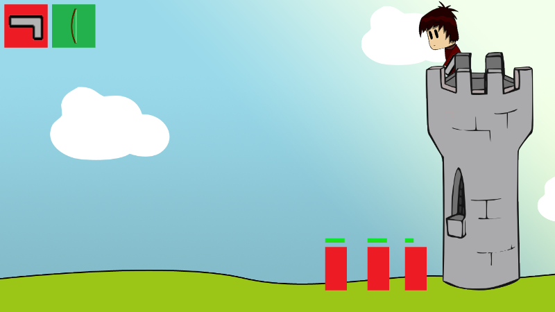

Il reste 27 jours et je me suis inscrit officiellement (depuis un moment maintenant) pour présenter mon nouveau jeu que j’ai dû nommer en vitesse afin d’en faire l’annonce et la promotion.

> Brezeliad : A Tale of Brocéliande

Le visuel du jeu n’a pas beaucoup avancé dernièrement puisque je recodais une partie du jeu afin d’obtenir plus de flexibilité. Maintenant que c’est chose faite, j’ai ajouté quelques fonctionnalités importantes : la vie des ennemis et le changement d’arme que je suis en train de mettre en place.

Actuellement, le jeu ressemble à ça :

C’est pas très sexy mais l’essentiel est là. J’ajoute chaque fonctionnalité petit à petit. J’espère que les screenshots seront un peu plus vendeurs à l’avenir.

Les prochaines fonctionnalités que je pense ajouter sont variées comme l’attaque des ennemis contre la tour (il faut bien un “meaning” au jeu), leur résistance à certaines armes et un système de sort à base de reconnaissance de formes.

Je ne pourrais pas faire l’histoire du jeu avant le Stunfest puisque ce serait une perte de temps et qualité sachant que les joueurs présents veulent plutôt jouer sans se prendre la tête (c’est une supposition et ce n’est pas le cas de tout le monde je sais). Je compte donc faire un mode Stunfest avec des maps dédiées au festival. Si vous vous sentez l’âme d’apporter votre contribution, vous pouvez me contacter ([twitter](https://twitter.com/YoruNoHikage) ou yorunohikage[a]gmail[dot]com) si vous souhaitez dessiner un personnage qui sera animé dans ces niveaux spéciaux.
