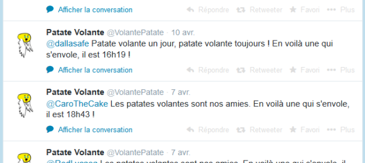

A quand le réseau social patate ? En attendant, la gentille patate est présente sur Twitter. Il y a quelques mois, j’ai fait un fork du bot Rand0matic créé avec NodeJS par [@outadoc](//twitter.com/outadoc "outadoc sur Twitter") ([un jeune geek que j’admire ?](http://outadoc.fr/2011/05/innovgame-2011-8-bit-robot-music-party-a-la-gloire-de-la-coop/ "Regardez le troisième paragraphe, sous la photo !")). Vous pouvez d’ailleurs retrouver son projet sur GitHub : [randomatic-twitter-node sur GitHub](//github.com/outadoc/randomatic-twitter-node).

La [@VolantePatate](//twitter.com/VolantePatate "Suivez-là pour recevoir l'actu patate !") car c’est son nom, retweet actuellement tous les tweets parlant de “patate volante” et elle répond un mot gentil à ces gens pour se manifester et diffuser la bonne parole patate à travers la diaspora francophone !

Ce billet est plutôt bref, vous pouvez retrouver mon projet sur GitHub également : [Patate-Volante-Twitter sur GitHub](//github.com/YoruNoHikage/Patate-Volante-Twitter). N’hésitez pas à le fork pour répandre vous aussi l’idéologie de votre mascotte !

Une petite vidéo pour finir :
<YouTube videoId="ipZOyzwndHQ" />
