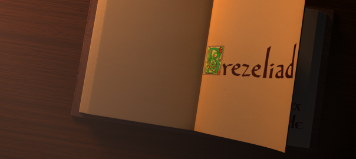

## 21 avril : Début du compte-rendu

Hello, aujourd’hui, j’aimerai vous parler du trailer de Brezeliad. Pour information, je devais envoyer un trailer pour le Stunfest afin qu’il soit compilé dans une vidéo qui tournerait en boucle pendant l’événement.

C’est alors que j’ai eu l’idée de faire appel aux services d’un ami, Nicolas (alias Enoriel). Seulement voilà, je suis venu vers lui un peu trop tard et ce dernier devait partir en vacances et abandonner son poste de travail. Il a donc pris sur lui et essayer tant bien que mal de me sortir un trailer digne de ce nom. On est parti sur l’idée d’un livre façon introduction de Shrek que je vous mets ici :

<YouTube videoId="RVsa1ETTXrA" />

Nicolas a bien bossé comme il fallait, seulement au moment de faire le rendu, il s’est aperçu que c’était beaucoup trop long et que ça n’allait pas le faire. Je lui ai donc demandé de me donner le projet afin de trouver quelqu’un qui puisse le rendre. La recherche commença, et j’ai finalement trouvé la personne qui me fallait, Thibault, étudiant en arts numériques. Il a accepté de me faire le rendu même si le logiciel ne correspondait pas à ses connaissances.

Le rendu fini, j’ai reçu le tout, mais manque de bol, il y avait pas mal d’erreur. À coup de traitement par lots avec Photoshop, j’ai pu transformer les 1100 images TIF en PNG afin de les intégrer avec VirtualDub en une vidéo. Et j’ai pu sortir un premier résultat qui ne correspondait pas vraiment à mes attentes malgré quelques images corrompues, inexistantes ou buggées. En effet, le début est génial, avec un petit bug, mais la fin est fausse et il manque plusieurs pages…

<YouTube videoId="QlB8IXJGmfo" />

J’ai donc vite fait corrigé les problèmes mineurs en redemandant à Thibault de faire un rendu des images à problèmes pour arriver à un résultat satisfaisant. Mais le plus gros restait à faire.

<YouTube videoId="jHkcDxc6yPo" />

Ne savant pas manier le logiciel, Thibault a donc décidé d’interchanger les textures et de rendre les premières pages avec les nouvelles textures. Avec la magie du montage, j’ai espéré que ça fonctionne…

## 22 avril : La fin approche

J’ai reçu la suite du rendu, le “rafistolage” ! Malheureusement (et oui encore), les nouvelles pages ont un texte trop clair, Nicolas n’avait pas du encore corriger ça, mais ça fait rien au point où on en était. J’ai tenté un raccord des frames (la différence de caméra est légère) et ça rend… pas bien du tout. Le mieux à faire a été de supprimer quelques frames afin de faire correspondre la caméra. La page se soulève un peu plus vite que prévue mais la différence n’est pas notable ! Enfin une version non buggée !

<YouTube videoId="Mr0QTcgub" />

En attendant les dernières frames qui devraient arriver, j’ai réfléchi à la musique en hésitant entre deux pour tomber sur celle-ci que beaucoup apprécient.

```<iframe
  id="widget"
  style="width: 560px; height: 180px; margin: auto; display: block;" src="https://widgets.jamendo.com/v3/track/1061452?autoplay=0&amp;layout=standard&amp;manualWidth=400&amp;width=560&amp;theme=dark&amp;highlight=6&amp;tracklist=true&amp;tracklist_n=3&amp;embedCode="
  width="560"
  height="180"
  frameborder="0"
  scrolling="no"></iframe>```

J’attends maintenant la suite du rendu pour continuer le trailer.

## 23 avril

Le reste des frames est arrivée, le montage s’est terminé et  voici le rendu final. Je ne suis pas très satisfait de la qualité de l’exportation, je vais donc voir pour l’exporter en meilleure qualité afin de le reposter. Mais en attendant, vous pouvez voir le résultat !

<YouTube videoId="PXG0Fjclsh8" />

Je remercie Nicolas pour m’avoir fait ce magnifique bouquin et Thibault pour le rendu, il a été très sympa quand il a fallut bidouiller pour obtenir quelque chose de correct.

## La suite ?

Pour la suite, c’est très simple, le Stunfest arrive et cette version du trailer y sera. Cependant, afin de ne pas rester sur un trailer légèrement bancal et pour être à la hauteur du travail élaboré par Nicolas, on essaiera de sortir une nouvelle version beaucoup plus léchée et dynamique. Une sorte de V2 !
