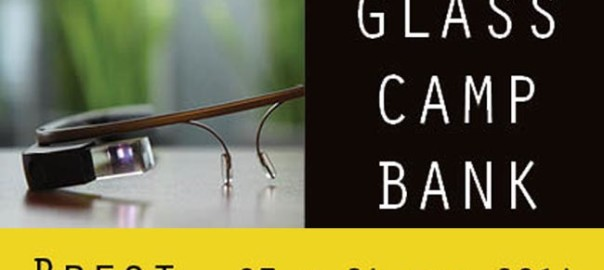

Hello tout le monde, le week-end dernier j’ai participé au **Glass Camp Bank**, un événement de développement en 36h sur Google Glass organisé par Arkea, et donc du coup sur le **thème de la banque**. Voici un petit retour d’expérience.

C’est en arrivant à Brest pour assister aux cours à l’ISEN et faire un projet de fin d’année, _pour rappel je suis à l’ISEN Rennes et à chaque fin d’année on part un mois à Brest,_ que j’ai vu sur Twitter l’annonce du Glass Camp Bank. Manque de bol, plus de places… Tant pis. Sauf qu’on me prévient quelques jours plus tard qu’un certain nombre vient d’être rajouté. Hop, on valide l’inscription et voilà !

Premièrement, le **bootcamp du jeudi soir**. On s’est galéré avec les installations donc on a pas suivi grand chose et comme **aucun émulateur n’est dispo pour Glass**, on est obligé de coder à l’aveugle… Tant pis, on verra demain.

Ensuite, le lendemain matin, (long) speech d’arrivée et on enchaîne sur un **échange d’idées et d’expériences sur la banque** de façon générale. Pour ma part, avec juste une galère sur un dépôt de liquide, je n’ai jamais eu de soucis sur les peu de fois où je me suis rendu dans une banque, j’écoute donc. L’étape suivante fut plus intéressante, elle consistait à **inventer des personnages-types**, les **personas**. J’ai contribué à la création d’Hélène Élégat-Reçon (oui c’est un jeu de mot pourri) qui se prend tuile sur tuile mais sans rejoindre le projet par la suite. Pour terminer, une **présentation en une minute**, chrono en main, devait être faite pour chaque persona et à cette issue, nous pouvions rallier le projet qui nous semblait le plus intéressant. Je regrette simplement que cette présentation de persona ne soit pas plus axée sur les solutions, je souhaitais travailler sur une solution intéressante (le cadre de la solution m’important peu) et non pas sur un problème à résoudre.

**J’ai donc rejoint le projet “Jimmy Crocket” pour gérer un solde prévisionnel à base de scans de tickets et d’alertes/notifications.** Le développement fut rude, heureusement que notre ami Clément à l’origine du persona savait y faire. Je n’ai pas beaucoup d’expérience sur Android et ses concepts me paraissent encore flou.

Pour terminer, **le premier prix a été remporté par mon équipier de toujours ([@Brindesable](http://twitter.com/Brindesable))** avec son équipe dans le projet IRIS. Collant parfaitement au thème de la banque (gestion des clients dans une agence) et avec un début de prototype, ils ont su plaire au jury et ont **remporté un prêt d’une paire de Glass pendant une semaine et un joli chèque de 1500€** qu’ils ont pu partager entre eux.

_Sortis riche en expérience de cet événement, un contact entre les élèves de l’École de Design de Nantes en recherche de développeurs pour leurs projets et inversement pour les élèves de l’ISEN de Brest et de Rennes est né. Un groupe vient d’être créé et j’espère sincèrement qu’il permettra d’aboutir sur des collaborations au sein de projets._
