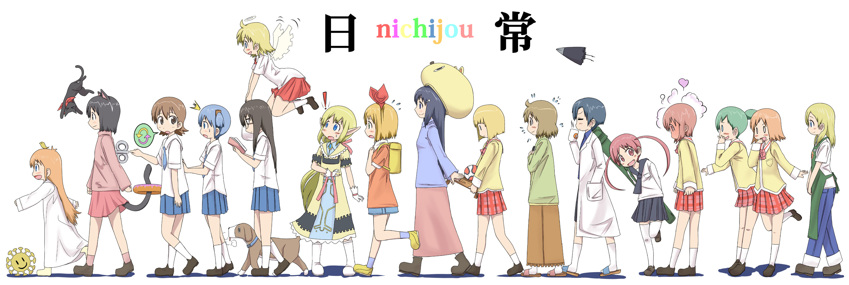

Hey, it's been a while! Today, I want to talk about anime again. Besides the fact that I finally watched Attack on Titans (and you should), I heard about Nichijō. It appeared to me like a reference or something, so I jumped into it. And what a weird encountering it had been.

The plot... I guess there is no plot. **You just take a bunch of people, mainly high school girls and somewhat connected to each other, and watch them live.** The episodes are composed with many short scenes that are independents but sometimes references are made to the past. And that's pretty much anything I can say about it.

If you happen to love absurd scenes like I do, I advise you to watch it right now, you won't be disappointed. And just for you, here's a glimpse at my favorite scenes (don't worry, you can't really be spoiled).

<iframe style="margin: auto; display: block;" width="560" height="315" src="https://www.youtube-nocookie.com/embed/DcQFBdLNvZU" frameborder="0" allowfullscreen></iframe>

> **Note**  
> I think 通 (tooru) means transparent, that's why she overreacted when hearing the word. But I have no clue for the small/short dilemma.

As a bonus, she gets back there to trick her friend a few episodes later.

<iframe style="margin: auto; display: block;" width="560" height="315" src="https://www.youtube-nocookie.com/embed/kAzTxzEeptM" frameborder="0" allowfullscreen></iframe>

And a last very funny one:

<iframe style="margin: auto; display: block;" width="560" height="315" src="https://www.youtube-nocookie.com/embed/ssmbYqbuP4E" frameborder="0" allowfullscreen></iframe>

If you want more, you could check out the mosquitoes scene, or simply watch everything. ;)
