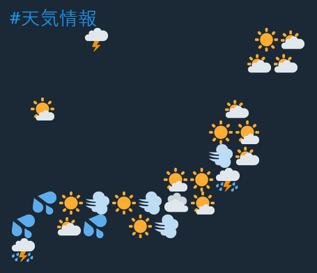

お久しぶりです！最近忙しくなったです！そして、リヨンに熱波が起こって、とても疲れさせました！
 
先の日、友達は僕に絵文字で作った天気情報の全国の地図に入ったツイットを送りました。そのアイディアはいいと思ったので、アカウントをフォローしました。これは例えです：

「今朝の天気」

その後、色々なコミュニティマネージャーが自分のブランドでこんな地図を作ってジョークになりました。早くインターネット・ミームになって[Yahoo UKはそれをニュースにお伝えしました](https://uk.news.yahoo.com/weather-tweet-becomes-masterclass-french-161510338.html)。

別の友達はブルターニュという僕たちのフランスの地元のバ－ションを作って送りました。それで、日本のバ－ションがありますかなと思って、なにも見つけませんでした。自分でこんな面白くて小さいプロジェクトを作って決まりました！

ジャジャン！絵文字で日本の天気！

サービスは自分で[@emoji_tenki](https://twitter.com/emoji_tenki)にツイットしています。気になったら、フォローして６時間ごとに天気をもらえます！:D
未来にたぶん漢字でスペシャルバージョンを作って今考えてる。
