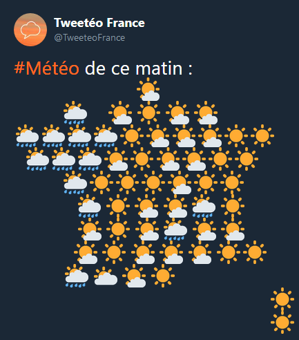
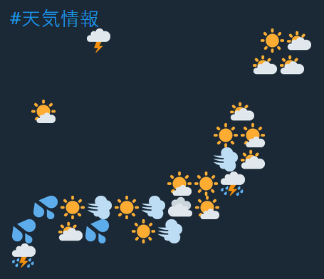

A few days ago, a friend sent me a tweet showing a map of France made of emojis representing the weather in each part of the country. I found the idea to be nice and followed the account. Here's what it looks like:  

[](https://twitter.com/TweeteoFrance)

Following this, several community managers took the opportunity to joke on the idea for the brands they were representing. It quickly became a meme [Yahoo UK even reported it](https://uk.news.yahoo.com/weather-tweet-becomes-masterclass-french-161510338.html).

Another friend of mine sent me a roughly made version of Brittany, the France's region I am from, that he wanted to make aswell. This got me the idea to look online for a Japan version of it with the corresponding words, tenki 天気 for weather, emoji 絵文字 which is originally a japanese word. But I didn't find anything, so it was a little project that I could build for fun.

The same way I made the [Twitter bot for my flying potato](http://blog.yorunohikage.fr/2014/04/12/une-patate-volante-sur-twitter/), I decided to go with simple free services not asking for so much maintenance. [Hook.io](https://www.hook.io) was one of the solution I had known that stores scripts online and executes them through a URL, as simple as I needed. A thing I didn't know before but that is very nice, is the ability to have your script directly on Github Gists and having it pulled automatically by hook.io, making it really easy to update your code unlike AWS Lambda for example.

With that settled, I started coding the script with the [`twitter` package on NPM](https://www.npmjs.com/package/twitter). I don't know how it will go for the future but Twitter is actually updating its developer platform as I write these lines. So, for now, I used the [former apps](https://apps.twitter.com), gaving me the customer key / secret and the access token / secret I needed to tweet on behalf of an account. The code then, is rather simple:

```javascript
import Twitter from 'twitter';

export default function postTweet(hook) {
  const client = new Twitter({
    consumer_key: hook.env.TWITTER_CONSUMER_KEY,
    consumer_secret: hook.env.TWITTER_CONSUMER_SECRET,
    access_token_key: hook.env.TWITTER_ACCESS_TOKEN_KEY,
    access_token_secret: hook.env.TWITTER_ACCESS_TOKEN_SECRET
  });

  const status = 'Hello word!';

  client.post('statuses/update', {status}, (err, data) => {
    if (err) console.log(err);
    
    hook.res.end('Tweet', status, 'has been sent!');
  });
};
```

And now onto the real problem, drawing the map and finding the weather. For the first one, I just went to my Twitter and played around with spaces and the Sun emoji on the input text... I quickly ran out of characters since Japan is a wide country but thanksfully, japanese full-width space is wide and only takes 2 characters like emojis. So here's my Japan emoji map:


If you think you can do better, don't hesitate to send me your result, I would glady update my script.

To get the weather information, I used Yahoo Weather API through a SQL-like language they made, YQL. All the information I needed on the data it gives me was the climate code under the condition key. Yahoo also uses a thing called woeid to represents places. So I made a list of places I thought the best and send it in only one request.

```sql
select item.condition from weather.forecast where woeid in (1, 2, 3...)
```

Now I only had to map the results to emojis. Here's the list from what I thought was the best:

code  |  emoji |  name
------|--------|-------------------------------------------
0     |   🌪️   | 	tornado
1     |   🌀   | 	tropical storm
2     |   🌀   | 	hurricane
3     |   ⛈   | 	severe thunderstorms
4     |   ⛈   | thunderstorms
5     |   🌧️   | 	mixed rain and snow
6     |   🌧️   | 	mixed rain and sleet
7     |   🌨️   | 	mixed snow and sleet
8     |   🌧️   | 	freezing drizzle
9     |   🌧️   | 	drizzle
10    |   🌧️   | 	freezing rain
11    |   💦   | 	showers
12    |   💦   | 	showers
13    |   ❄    |	snow flurries
14    |   🌨️   | 	light snow showers
15    |   ❄    | 	blowing snow
16    |   ❄    | 	snow
17    |   🌨️   | 	hail
18    |   🌨️   | 	sleet
19    |   🤔   | 	dust (I don  t know for this one yet)
20    |   🌁   | 	foggy
21    |   🌫️   | 	haze
22    |   🌫️   | 	smoky
23    |   💨   | 	blustery
24    |   🍃   | 	windy
25    |   🥶   | 	cold
26    |   ☁    | 	cloudy
27    |   ☁    | 	mostly cloudy (night)
28    |   🌥️   | 	mostly cloudy (day)
29    |   ☁    | 	partly cloudy (night)
30    |   🌤️   | 	partly cloudy (day)
31    |   🌑   | 	clear (night)
32    |   ☀    | 	sunny
33    |   🌑   | 	fair (night)
34    |   ☀    | 	fair (day)
35    |   🌧    | 	mixed rain and hail
36    |   🥵   | 	hot
37    |   ⚡️   | 	isolated thunderstorms
38    |   🌩️   | 	scattered thunderstorms
39    |   🌩️   | 	scattered thunderstorms
40    |   🌧    | 	scattered showers
41    |   ❄    | 	heavy snow
42    |   🌨    | 	scattered snow showers
43    |   ❄    | 	heavy snow
44    |   🌤    | 	partly cloudy
45    |   ⛈️   | 	thundershowers
46    |   ❄    | 	snow showers
47    |   ⛈️   | 	isolated thundershowers
3200  |   ❔    | 	not available

Last step, making it into the tweet! Nothing more simple: dumping every variables into a template string, and sending it to Twitter. Important thing to keep in mind: Twitter trims the tweet, so you have to put something at the beginning that isn't a space.

And voilà!



With that being done, the script works but you have to activate it yourself. To create a regular call, I thought about using hook.io cron jobs, but they didn't seem to work at the moment I was doing this. So I went to a little service called [IFTTT](https://ifttt.com/) working on the principle: if **this** occurs, then do **that**, the bold part being chosen through services they offer. So I picked Dates and Webhooks and made it into an applet: if **each day at 12pm**, then **calls this URL**.

The service is now fully working by itself on [@emoji_tenki](https://twitter.com/emoji_tenki) if you want to follow it and get the weather every 6 hours. :D

I also thought about trying to make a special version with Japanese kanji representing the weather (雨、晴、雷、雪…), I might give it a shot later.

See you next time!
