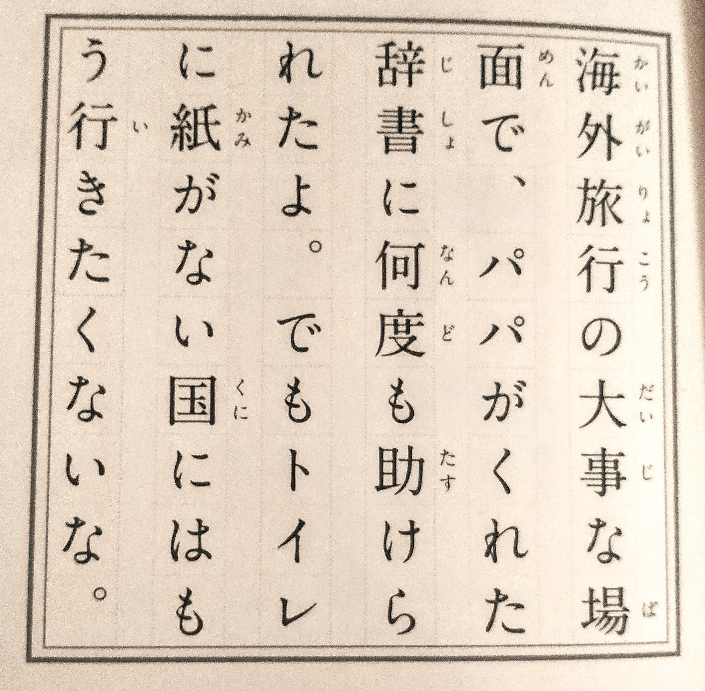
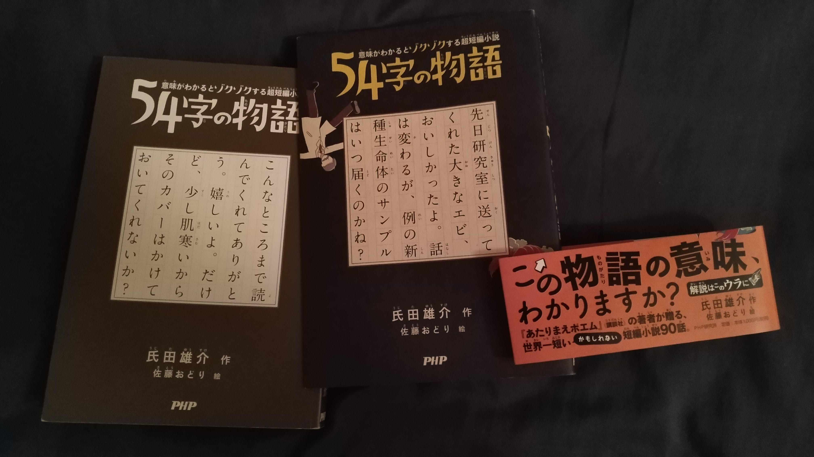

It's been a while **I was looking for material to improve my Japanese**, getting to know more kanji, knowing words and expressions. I've been trying to read the short news on the NHK easy website, but I wasn't really into it. Since the content is changing almost every day, you don't see any form of progress or rewards.

But these days I've been in Paris for work and decided to stop by the Japanese bookshop there, it was literally 15 minutes away from the workplace. It's quite a big place, with two floors, comparing to what you can find in Lyon... nothing. So I just went there straight after work to take a look and stumbled across the easy-to-read and recommended book section. And there was this book, called the **「54字の物語」**, literally **"Stories in 54 characters"**. The lady told me the required kanji level for this was similar to what primary school students knows in Japan and on each page, you get a simple explanation of the previous page's short text. So I decided to give it a shot.

&copy; [@ujiqn](https://twitter.com/ujiqn)

To spice things up, and since there is **90 stories**, I thought it could be cool to **challenge myself to read one per day**. But, to be sure everything was understood and to keep on doing it, I had to write the translation down somewhere. You know how it is easy to just let something go and forget about it. I had no intention in ruining the book by writing on it. I didn't think it would either fit a blog post, so **I went with Instagram stories instead**. It seemed like a good place: picture, to show the original story, text, to write the translation on it and also a pin functionality on the profile, to keep them in one place, separated from the other random stuff I can share. Nice!

**So here you go, I currently read and "translated" half of the book you can now watch here:**

🎉 **[The stories in 54 characters challenge on Instagram](https://www.instagram.com/stories/highlights/17934446089201395/ "54字の物語チャレンジ").** 🎉

Along the way, I noticed a few things that made this book even more interesting. A lot of stories are made according to a pattern: **a normal situation is described followed by a pun or a weird element that completely change the understanding of the situation**. For example, in the first pages, there's a funny story that made me laugh:

_"During important moments of my trip abroad, the dictionary my father gave me saved me many times ! But, I don't want to go in countries without toilet paper in the restroom anymore." If you didn't understand the joke, the guy probably had to use his dictionary to wipe himself, just saying._

In an even more creative way, I found a story that is sort of an Easter egg. In Japan, unlike France, **a lot of books have a dust cover** and, sometimes, even a promotional belly-band, called obi coming from the Japanese kanji 帯. These are usually better crafted than the underlying cover. The paper is often soft or shiny and colorful, unlike the simple and monochrome cover it protects. And a lot of **manga I've been reading often hide small drawings there**, like funny cartoons related or not to the story you can find inside. K-ON!, for example, had these silly 4-cases short stories, Fullmetal Alchemist had one black cartoon per pure white cover... This has also inspired foreign drawers to make their own, French manga-like Lastman for example. It has this sex scene (nothing graphical) under the dust cover with the main character saying "what are you looking at?". It makes the undercover a private place where things shouldn't be seen but you'd still want to peek in. It can also be kind of a tool to hide what wouldn't have been accepted in a library or simply random thoughts and sketches not matching the content.

When **I removed the dust cover** to see what's inside — note that I've been so used to these, it's almost a mechanical thing to do when I buy a book with a dust cover now — I found a short story, how surprising... But I didn't immediately notice it was a different story from the one on the dust cover, the latter being just a retake from the book. So when I read it, **I'd wanted to clap the author for such a clever note.**

_Undercover story: Thanks for reading this far. I'm happy! But, as it is a bit cold, could you put back the cover?_

This simple short story reflects the humor the entire book is made of and this comparison with the cover of the book being wore to stay warm is brilliant I think. Congrats! 👏

I encountered **another story type as well in a way they use the language itself to play with it**. I remember one story where a thief stole a plate, _plate_ whose writing was also included in the _steal_ character, but as it was stolen, it changed the meaning of the story. I don't remember if this was the first case of "writing play" I had seen but it sure is very clever. Either be meaning, writing or pronunciation tricks, this book has a lot to offer.

---

At the end of the book, the author explains a few things to make your own stories as well and share them on social networks. I might want to try writing my own stories later on, we'll see if I feel like it.

I also thought about it since the beginning, but I'm following and supporting Dogen's awesome lessons on Patreon about [Japanese pitch-accent patterns and phonetics](https://www.patreon.com/dogen), and it could be nice to try recording myself pronouncing these short sentences as a way to practice.

**If you understand Japanese, I encourage you to see the author's other works, it is really interesting and I love his website: [thinking.co.jp](https://thinking.co.jp/)**

While writing this article, I came across the announcement of [the second volume](https://amzn.to/2Rm4nVp), chills special, now available. Take a look at it! I'll definitely buy it some day and might do this challenge myself one more time.

See you!