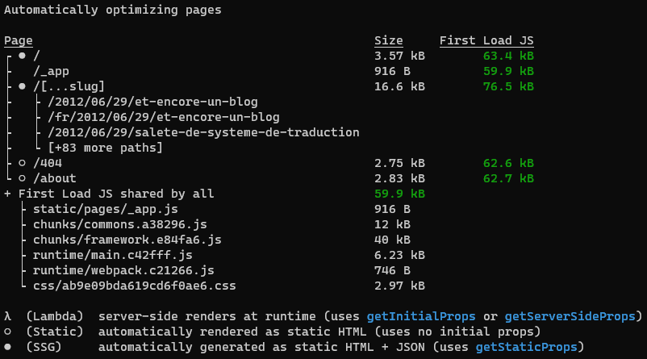

When it comes to make a sitemap, Next doesn't want it to be as easy as making pages.

**A sitemap is just an XML file listing all your pages your website has**, making it easier for search engines to find all the informations it needs without having to follow links here and there. You can also specify some data like changes frequency and priorities.

First of all and before anything, [do you really need a sitemap?](https://support.google.com/webmasters/answer/156184?hl=en&ref_topic=4581190) I didn't but I like it, so I made it.

Have you ever got sad seeing this screen being unable to make a good use of that data to make your sitemap?



So how can you make a sitemap with Next? People who got through this pain usually follow one of these 3 methods:

## Guerilla Sitemap

Just write yourself the damn file and put it in the public folder.

```xml
<?xml version="1.0" encoding="UTF-8"?>
<urlset xmlns="http://www.sitemaps.org/schemas/sitemap/0.9" xmlns:image="http://www.google.com/schemas/sitemap-image/1.1" xmlns:news="http://www.google.com/schemas/sitemap-news/0.9" xmlns:video="http://www.google.com/schemas/sitemap-video/1.1" xmlns:xhtml="http://www.w3.org/1999/xhtml">
  <url>
    <loc>https://blog.yorunohikage.fr/</loc>
  </url>
  <url>
    <loc>https://blog.yorunohikage.fr/about</loc>
  </url>
</urlset>
```

Great but I don't have a 3 pages portfolio website.

## Dynamically rendered

For you guys, you usually **need to update your sitemap in real time as data is changed and updated indepentently from the builds**. From there, you have two choices. Either you generate it from the `/api` folder like this:

```js
// pages/api/sitemap.xml.js

export default (req, res) => {
  res.statusCode = 200;
  res.setHeader('Content-Type', 'application/xml;charset=utf-8');

  // grab the info you need...

  res.write(sitemap);

  res.end();
};
```

Or you can use a trick using `getServerSideProps` in a `sitemap.xml.jsx` file like this:

```jsx
// pages/sitemap.xml.jsx

export const getServerSideProps = async ({ res }) => {
  res.statusCode = 200;
  res.setHeader('Content-Type', 'application/xml;charset=utf-8');

  // grab the info you need...

  res.write(sitemap);

  res.end();
};

// a component is needed
export default () => null; 
```

You can explore a bit more these solutions (with caching) in the articles [Next.js 9.3 - generating a sitemap from dynamic content](https://www.pkj.no/p/nextjs-generating-a-sitemap-from-dynamic-content) and [Create a Dynamic Sitemap with Next.js](https://leerob.io/blog/nextjs-sitemap-robots#dynamic-sitemaps). 

**But I know this is not what you want.**

Either way, your file is not generated statically and if you're like me, you know you can go f... yourself if you try to glob the filesystem on now.sh.

## So how can I render it statically during the build process?

Observing what Vercel did, I took example from their very own [Next.js website](https://nextjs.org/). They don't have any sitemap available (or I didn't see it) but they do have an RSS feed which would require pretty much the same process.

What they apply is, **they first hook into the webpack config** within the `next.config.js` adding their script to the webpack entries list that gets processed:

```js
module.exports = {
  target: 'serverless',
  webpack(config, { dev, isServer }) {
    if (!dev && isServer) {
      const originalEntry = config.entry;

      config.entry = async () => {
        const entries = { ...(await originalEntry()) };

        // These scripts can import components from the app and use ES modules
        entries['./scripts/build-rss.js'] = './scripts/build-rss.js';

        return entries;
      };
    }

    return config;
  },
},
```

This builds it into `./next/serverless/scripts/build-rss.js` along with all the things you need from your project code. Now, after the build step, they just execute the newly built script.

> Be careful, if your **target** is different, the folder will be different ! **"server"** is the default but now.sh enforce **"serveless"**.

So what's inside this script and how can we apply that to make a sitemap?

```js
// https://github.com/vercel/next-site/blob/master/scripts/build-rss.js

// ...

function importAll(r) {
  return r.keys().map(r);
}

const previewItems = importAll(require.context('../blog', false, /\-preview\.mdx$/));

// ...

function generate() {
  // ...

  fs.writeFileSync('./.next/static/feed.xml', rss);
}

generate();
```

Every `-preview.mdx` files are imported and used to build this RSS feed that is finally written to the built folder.

Applying the same principles, I made this:

```js
// scripts/generate-sitemap.js

const fs = require('fs');
const { SitemapStream, streamToPromise } = require('sitemap');

// 1. Importing all the .jsx in the pages folder and keeping their paths
function importAll(r) {
  return r.keys().map((key) => ({ path: key, module: r(key) }));
}

const pages = importAll(require.context('../pages', false, /.jsx$/));

async function generateSitemap() {
  // 2. Creating a sitemap using a third-party package
  const smStream = new SitemapStream({
    hostname: 'https://blog.yorunohikage.fr',
  });

  await Promise.all(
    // 3. Looping through all the paths we found in pages folder
    pages.map(async ({ path, module }) => {
      // filename starting with _ are ignored
      if (/_[^/]+\.jsx/.test(path)) return;

      // has brackets -> find getStaticPaths or ignore
      if (/\[.+\]\.jsx/.test(path)) {
        const { getStaticPaths } = module;

        if (getStaticPaths) {
          // getting all the statically generated paths
          const { paths } = await getStaticPaths();

          // replacing parameters in the dynamic path and writing it to the sitemap
          paths.forEach(({ params }) => {
            let pathToBuild = path.replace('./', '');
            Object.entries(params).forEach(([key, value]) => {
              const isSplat = Array.isArray(value);
              pathToBuild = pathToBuild.replace(
                `[${isSplat ? '...' : ''}${key}]`,
                isSplat ? value.join('/') : value,
              );
            });

            smStream.write({
              url: pathToBuild.replace('index.jsx', '').replace('.jsx', ''),
            });
          });
        }

        return;
      }

      // just a normal static path
      smStream.write({
        url: path.replace('index.jsx', '').replace('.jsx', ''),
      });
    }),
  );

  smStream.end();

  const sitemap = await streamToPromise(smStream);

  // 4. Finally, you write everything in a file on the public folder
  fs.writeFileSync('public/sitemap.xml', sitemap);
}

generateSitemap();
```

The most important part here, where the magic happens, is the loop. The data from all the `getStaticPaths` functions gets matched to the dynamic paths you found on your filesystem.

> This code is not made for hybrid websites, either you ignore the dynamically generated routes or you use one of the dynamically rendered method above.

Just replace your build command with `next build && node ./next/serverless/scripts/generate-sitemap.js` on your script and you're good to go.

## Summary

- Write your sitemap yourself if you only have a few pages, or don't even write one
- If you need a dynamic sitemap from dynamic data, either use an `/api` endpoint or the `getServerSideProps` trick
- Statically generating a sitemap is possible but it needs to be defined in a pre-built script before execution if you want to re-use your data-fetching logic
- `getStaticPaths` can be used to get the generated data, then you just have to search/replace parameters within the routes and build the sitemap

## Final thoughts

On a final note, you might want to subscribe to the GitHub issue : [[Feature Request] native static sitemaps](https://github.com/vercel/next.js/issues/12354). Some day, we could get a true native way to hook into the static generated routes and ditch all these tricks for an easier and cleaner method. But for now, this suits my blog and I hope it did help you.