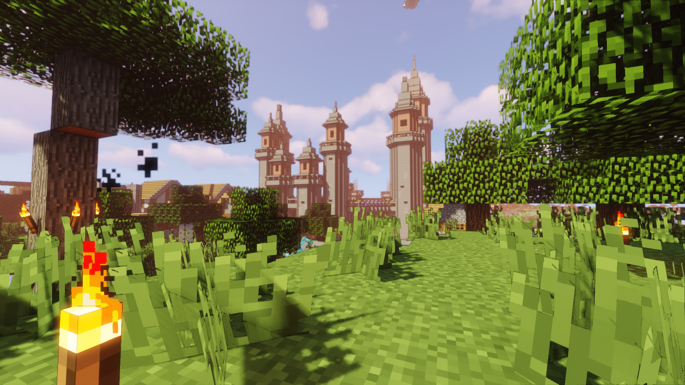
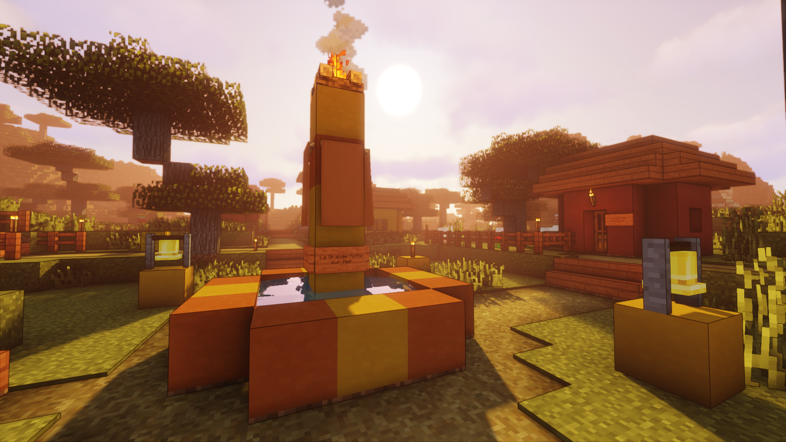
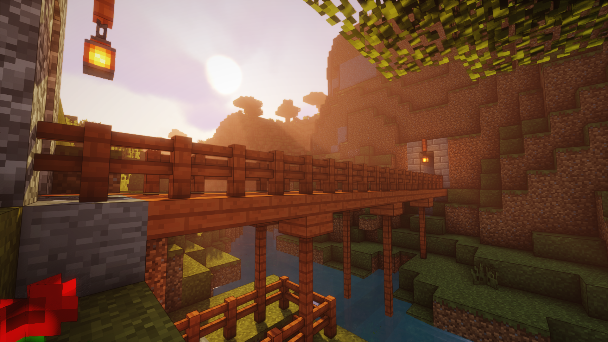
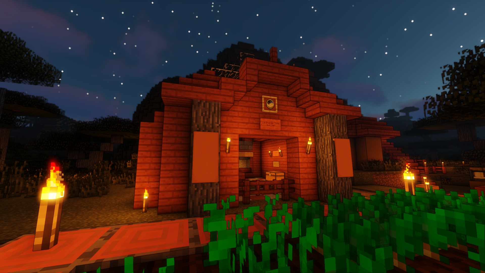
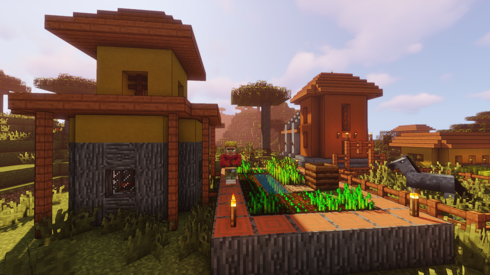
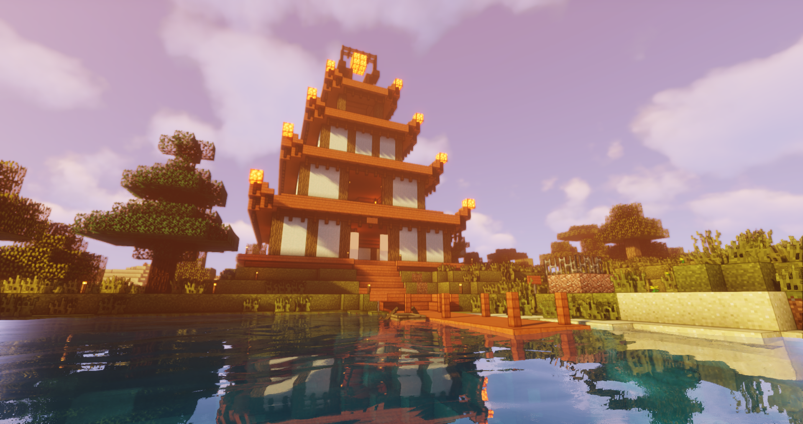
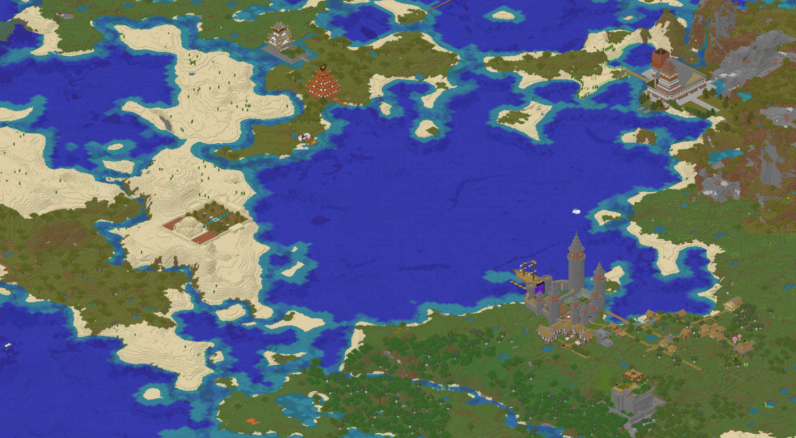

Après avoir passé plusieurs soirées avec des amis à poser des blocs pour me divertir, passer du bon temps et poser des panneaux aléatoirement, **j'en suis venu à regretter de ne jamais avoir gardé une trace de ces différents serveurs** dans lesquels j'ai pu apporter ne serait-ce qu'une petite contribution créative et qui, a l'heure d'aujourd'hui n'existent peut-être plus.

**Les souvenirs de ces créations deviennent floues au fûr et à mesure que les années passent et je ne souhaite pas laisser la même chose arriver** dans ce cas présent si tant est que ce blog survive à l'apocalypse qui nous attend tous de toute façon.

Oublié le temple japonais relié par un long chemin à l'écart de la ville ou encore le réfrigérateur et la table dans une cuisine de taille démesurée. **Nous voici maintenant sur un serveur qui n'a pas de nom spécifique** (pour l'instant ?). Rejoint il y a peu, il a déjà subit nombre de changements.

## Le Puy du Ouf

À mon arrivée, il était composé d'une seule petite ville "habitée". **Le Puy du Ouf, comme son nom l'indique choque au premier abord par son château fort** renfermant une petite dizaine de prisonniers marchands dont la seule utilité pour les personnages joueurs se résume à l'achat à bas prix d'équipements utilisés dans le cadre de quêtes de découvertes.

Une gigantesque porte vers le Nether en fait **un site touristique accessible** pour qui traverser les dimensions ne représente aucun problème. S'ajoutant à cela, un port y est adossé afin de faciliter les déplacements fluviaux vers les différents endroits qui vous seront présentés dans cet article. Il est à noter la présence d'une genre de caravelle dont les amarres ne sauraient être larguées de sitôt.

**Le reste de la ville est composé d'un certain nombre d'habitations construites par les joueurs** mais fondé sur une base pré-existante. On y trouve de nombreux villageois dans des corps de métier tout aussi variés s'affairant à leurs occupations quotidiennes. De temps à autres, zombies et autres monstres viennent perturber la tranquilité de la ville et défoncer quelques portes dans leurs poursuites meurtrières des joueurs.

## La découverte

Le Puy du Ouf fut l'occasion de se familiariser avec ce monde hostile. Mais vint alors la lassitude et le besoin d'aventure. Il était temps de partir.

**Pour la première expédition, l'objectif fut d'aller découvrir l'ouest**. Nous fûmes cependant coupé dans notre élan en arrivant à l'endroit d'où nous étions partis. Cocasse, l'antagonisme parfait de la découverte des amériques. Croyant découvrir de nouveaux territoires, **nous avions seulement fait un joli tour.**

Tout ne fut pas vain pour autant. Les **deux nouveaux villages découverts** sur la route furent immédiatement pillés - une pratique systématique questionnable - puis nommés. Le premier, composé de quelques maisons perdues au creux de deux montagnes fut baptisé **Sunrise Valley**. Nous n’y restâmes que peu de temps, notre intérêt fut bien plus grand pour la deuxième bourgade. **La Grande Motte sur Mer**, sa colline surplombant la côte justifia le choix du nom, allait être témoin de nombreux changements.

À peine les premières pancartes posées, un besoin d'aventure se fit ressentir. L'End nous appelait. Et tel un mineur sentant la proximité du diamant, nous ne pûmes résister à la tentation d'y aller.

## À la conquête de l'End

Revenu au Puy du Ouf et stuffé comme des cochons grâce à la générosité des marchands du château, le groupe d'une demi-douzaine de bras cassés passa l'imposante porte du Nether pour ensuite rejoindre, empruntant un chemin protégé, la porte de l'End. Par **une stratégie de groupe bien ficelée**, chacun des membres alla se poser individuellement sur une tour **afin de bolosser le dragon à coup de flêches**. Il fut facilement vaincu non sans quelques décès. RIP.

Dans ce monde, la difficulté de la tâche réside principalement dans le fait d'**éviter le regard des endermen qui pullulent**. Au moindre croisement du regard, c'est la victimisation assurée. Seul l'eau peut vous protéger de ses êtres qui se téléportent à vos côtés instantanément pour vous asséner de petits coups fourbes.

Mais là ne s'arrête pas l'histoire, **il est ensuite possible de se mettre à la recherche de cités de l'End**, sortes de tours contenant des cadeaux, rien de bien glorieux. Après une longue errance entre les îles volantes dangereuses et les quelques petites cités quelques peu insignifiantes, le groupe revint sain et sauf téléportés par les Saintes Commandes admin. C'est chiant de revenir au portail du début - eh oh ça va hein !

## La Grande Motte sur Mer

Ce fait héroïque accompli, les sessions suivantes furent consacrées quasi-exclusivement à re-dynamiser, pour ne pas dire gentrifier la Grande Motte sur Mer. **Une ligne de chemin de fer la relie désormais au Puy du Ouf.** En majorité souterraine et aux virages très serrés, c'est dire si ça secoue ! Elle est digne des meilleures attractions de Disneyland, supportable pour des enfants qui ne trouveront rien à redire bien évidemment. Attention à ne pas vomir son quatre heure.

À l'arrivée **dans la gare de la Grande Motte sur Mer, un distributeur de pastèques se trouve à disposition** de celui qui cherche à étancher sa soif ou se rafraîchir. Les acteurs de la redynamisation jugèrent la nécessité de ce genre d'**installation aussi importante que celle des fours communaux en libre-service, de l'élevage de mouton et de la chapelle** dans les tons de la ville.

Côté alimentation, la réhabilitation des productions agricoles de la ville eut un impact non négligeable. Les choix originaux d'exploiter des parcelles du versant de la grande motte menant à la partie supérieure du village n'avait sûrement pas été mûrement réfléchis et le terrain peu facile à cultiver de part sa nature a retrouvé son caractère naturel depuis.

Non loin de là se tient dorénavant **un grand escalier reliant les parties supérieures et inférieures**. Grâce à cet ouvrage, les villageois ne se retrouvent plus dans l'obligation de devoir dévaler la colline pour se rendre en ville.

Mais la vie n'est pas rose et **la configuration peu protégée** de la Grande Motte sur Mer conduit à une **tragique extinction temporaire de la population locale**, dommage colatéral des travaux qui durèrent de nombreux jours et nuits heure locale.

Malgré une enquête poussée, rien n'avéra que les vagues de zombies et la relative proximité d'un mineshaft en aient été la cause. La piste d'**une population relativement âgée et fortunée**, venant passer ses derniers jours en bord de mer et se retrouvant à casser sa pipe, dans un intervalle de temps restreint, potentiellement dû au **stress des travaux**, ne fut pas exclue.

Depuis, **la Grande Motte sur Mer a retrouvée une population active**. L'insécurité alimentaire des lieux, malgré la présence de diverses exploitations agricoles, poussent les villageois à systématiquement s'orienter dans une carrière de pêcheur.

La ville côtière a donc retrouvé son caractère maritime d'antan mais **la pression sociale reste forte** et les différentes tentatives d'éviter le péché qu'est **la conversion des prêtres en pêcheurs ont toutes échouées**. La chapelle vide reste disponible pour quiconque voudrait venir y prêcher ses sermonts, mais **gare au péché du pêcheur**.

## Village japonisant

Le plan de relance de la Grande Motte sur Mer ainsi effectué, c'est sur un **projet de village japonisant** que se reporta la force de travail. D'abord par **un temple** composé d'un ascenseur téléporteur, d'un petit jardin et d'une source chaude. Puis par **un château traditionnel inspiré de celui d'Osaka**. Les travaux ne sont pas encore finis à la rédaction de cet article ni l'aspect village et le nom qui ne sont pas non plus déterminés.

## Des outils pour pimenter le tout

**La communauté de Minecraft est très active.** Entre **les mods** qui permettent l'optimisation, je pense notamment à [Optifine](https://optifine.net/home) qui doit être un des plus connus. Mais également aux **shaders** qui rajoutent un côté naturel. C'est d'ailleurs [Sildur’s Vibrant Shaders](https://sildurs-shaders.github.io/) qui est utilisé pour les captures d'écran de cet article.

Il ne faut pas non plus oublier **les outils autour du jeu** comme [Overviewer](https://overviewer.org/) qui permet de générer une carte interactive. C'est quand même super cool de voir apparaître ses constructions et explorer les différents endroits que les joueurs ont découverts.

Voilà qui clôt **un résumé de quelques petits mois** de détente. On épargnera certains détails et les quelques bâtiments d'une taille démesurée qui sont également en construction sur la carte mais qui manquent encore de contexte pour figurer dans une rubrique spécifique. Loin de moi l'idée d'imposer un narratif qui pourra évoluer en fonction de chacun au fûr et à mesure des sessions. Si matière à développer se présente, cet article connaîtra peut-être une suite, qui sait.