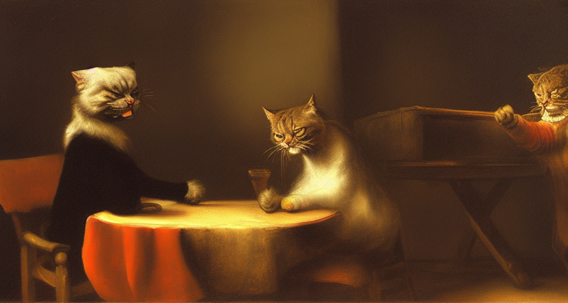
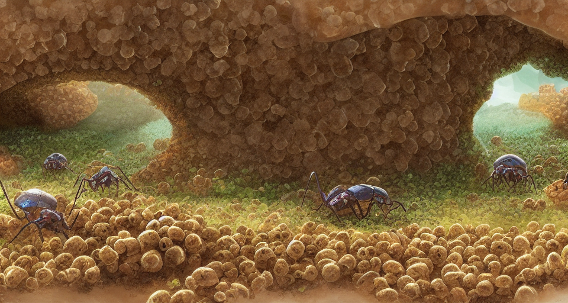
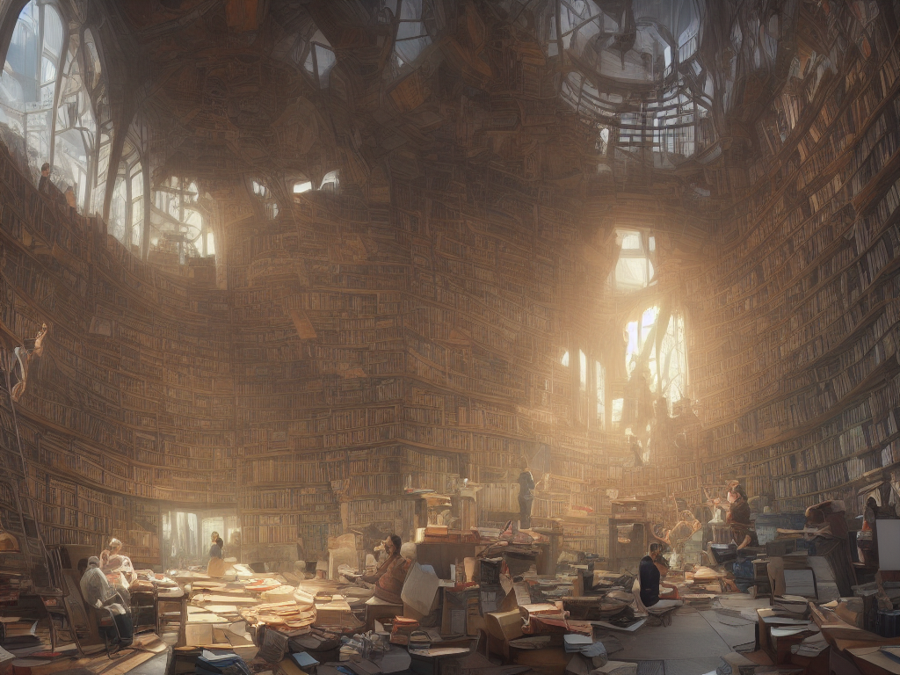
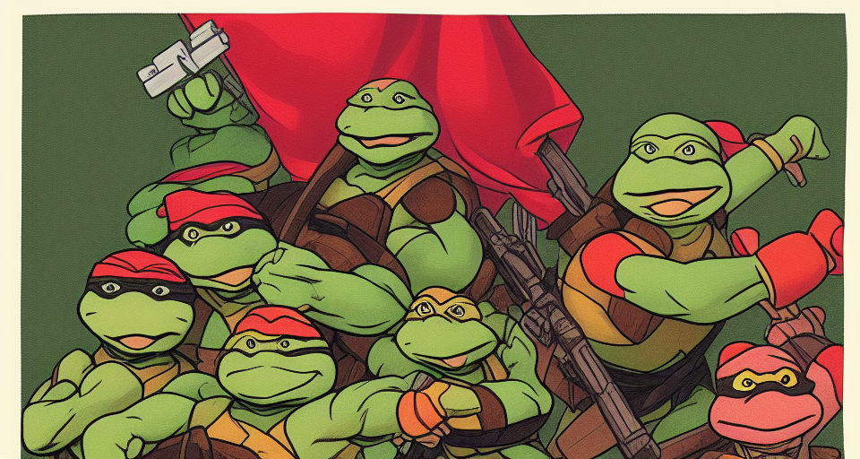

# Les IA : la fin de l'art triste ?

En ce moment, on voit passer beaucoup d’illustrations générées grâce à des plateformes comme Midjourney ou DALL·E et ça crée du débat autour du métier d’illustrateur et de la place de ces outils dans le monde créatif. Alors, pour, contre, c’est compliqué ?

An oil painting of two angry cats arguing over a table made by Rembrandt

La question du remplacement des métiers par les robots (ou maintenant les IA) est assez vieille et on a longtemps démontré qu’elle était impossible à enrayer, quoiqu’on le veuille ou non. Il s’agit davantage de savoir à qui profite cette automatisation et qui se retrouve lésé et il convient d’y remédier d’une autre manière. Bien souvent l’automatisation sert à supprimer des tâches pénibles accomplies par des gens qui n’ont pas d’autre choix que de les accepter pour vivre.

Les IA et la génération d’images qui ont pu sortir ces dernières semaines fait planer un doute sur les métiers créatifs jusque là nécessaires. Hors, faire une affiche de publicité pour le dernier parfum ou une énième promotion sur un paquet de saucisses n’a rien d’épanouissant, d’autant plus que le marketing cadre le besoin très précisément afin qu’il puisse atteindre au mieux sa cible. Cela ne sert aux graphistes qu’à pallier le besoin de rémunération pour leur survie. Alors si un outil peut leur éviter ça, il n’est que bon à prendre.

On pourrait naïvement penser que rien n’empêche un créatif de continuer son art en cohabitation avec les IA qui de toute façon vont se multiplier mais si sa rémunération est mise en danger par ces dernières, c’est bien la mise en compétition qui est à pointer du doigt. Le tout étant de savoir comment on évite à une partie de la population de s’accaparer le pouvoir qu’implique cette dans une économie comme la notre pour en faire payer une autre et l’exploiter par ailleurs.

Inside of an anthill where ants are bringing food to their queen, concept art

Le droit d’auteur vient s’immiscer rapidement dans la conversation et quand on considère qu’une IA ne fait que recracher un mix de ce qu’elle a appris, on comprend vite qu’elle se base sur des travaux pré-existant d’artistes qui n’ont pas leur mot à dire sur l’exploitation de leur travail passé.

À cela, j’oppose le cerveau humain qui fait exactement le même travail, voire même mieux et il se base sur ce que l’on expérimente au cours de sa vie. La limite étant bien souvent la mise en application dans le réel, les capacités physiques du corps qui n’est pas assez entraîné pour la réalisation de l’idée. Et si tant est que l’imaginaire ait la possibilité de créer quelque chose à partir de rien, c’est peut-être de là que viendra la plus-value des humains à ces outils : pouvoir rajouter une couche d’inconnues à une base générée par une IA.

La question du [concours gagné par le résultat d’une IA](https://www.lebigdata.fr/midjourney-concours-art) a aussi contribué à nourrir la polémique. Un auteur ayant envoyé pour un concours d’illustration une image générée par une IA l’a remporté. Peut-on alors considérer au même niveau un artiste utilisant ce genre d’outils et un illustrateur qui a passé de nombreuses années à perfectionner son art ? Si seule la technique est jugée, doit-on se priver des oeuvres retouchées avec des filtres, des effets et autres simples algorithmes pour se contenter uniquement de celles faites à partir d’une feuille et d’un crayon ? Vous sentez peut-être déjà venir l’ironie d’où commence et s’arrête l’utilisation de technologies.

L’auteur lui-même explique avoir passé environ 80 heures à affiner la génération, choisir un résultat et y apporter quelques retouches dans Photoshop, on ne peut donc pas lui retirer le fait qu’il ait travaillé à affiner son oeuvre que ce soit dans la génération mais également sur les finitions "à la main" (pour continuer l’ironie) sur Photoshop.

Est-ce vraiment différent d’une musique remixée où l’artiste passe son temps à choisir ses samples, en jette la moitié pour créer une oeuvre originale dans laquelle certains des éléments originaux sont tellement retouchés qu’il est quasi voire impossible de reconnaître la source ?

Les concours ont parfois différentes catégories, qu’elles soient très restrictives ou au contraire complètement libres. Alors le choix revient aux organisateurs d’adapter leurs règles et leurs conditions quand bien même au final, le but reste de faire une jolie illustration, non ?

Illustrators working on a huge poster inside a bright library, matte painting trending on artstation HQ

Le discours du gagnant permet aussi de ne pas oublier une chose : les intelligences artificielles reposent actuellement sur une interface textuelle dans la majorité des cas. Il faut rentrer des mots-clés ou des phrases explicatives qui vont venir conditionner les résultats que l’on souhaite. Un mot différent peut tout changer.

Partant de ce constat, dans les années à venir on verra sûrement émerger une nouvelle génération d’illustrateurs qui vont développer des compétences dans les mots à utiliser pour générer les meilleures images possibles. Et ils pourront se vanter d’avoir entraîner de longues heures durant, leur immense cerveau pouvant retenir une quantité incroyable de mots de vocabulaire pour affiner tel ou tel résultat.

Et avec les outils qui s’améliorent comme ce plugin Photoshop qui permet de retravailler des parties d’une image, on pourra aussi affiner localement les résultats.

<Tweet tweetId="1563162131024920576" />

De la même façon qu’Illustrator, Photoshop ou encore la photo n’ont pas remplacé la peinture à l’huile, l’aquarelle ou les crayonnés à la main, les IA ne seront qu’un outil supplémentaire sur lesquels les illustrateurs pourront se baser pour exercer leur art.

Il faut simplement s’attendre à ce que le monde capitaliste, lui, cherche à s’accaparer ces outils en faisant payer l’utilisation et les résultats pour son propre profit. Qui disait "il faut saisir les moyens de productions" déjà ?

Portrait of a teenage mutant ninja turtle Karl Marx, cartoon