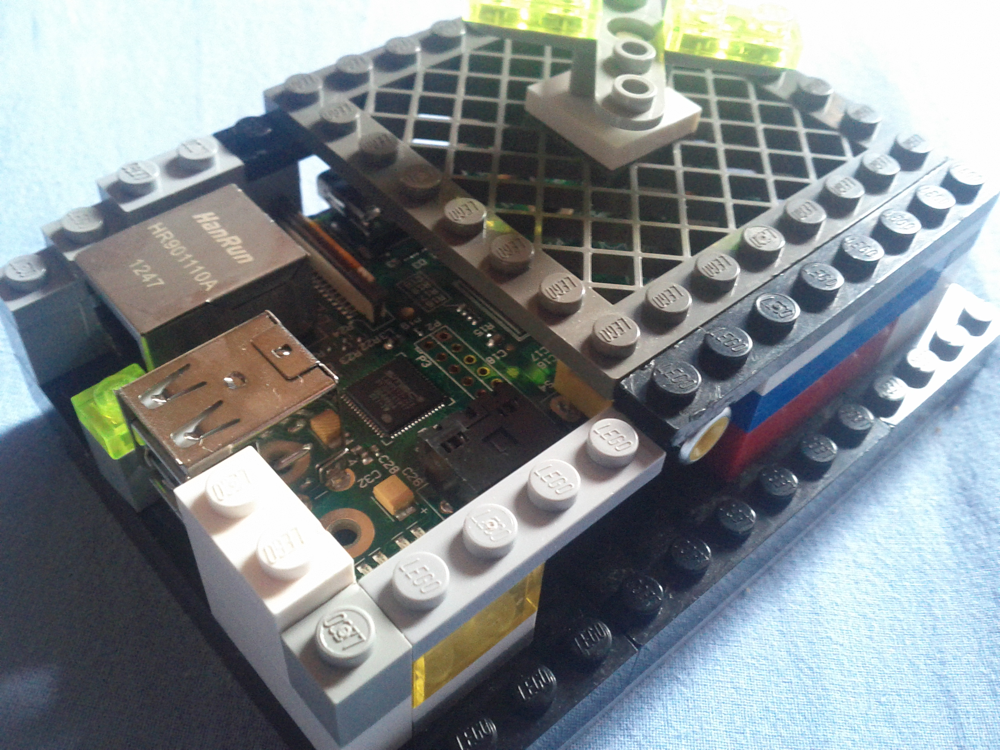

Ça y est, je l’ai acheté ! J’ai enfin un **Raspberry Pi** ! \o/. Je comptais le prendre à sa sortie et puis avec le temps, je me suis demandé si j’en aurai réellement besoin et j’ai attendu. Au final, je suis pas déçu \o/. C’est le **Model B avec 512Mo de RAM**.

J’ai choisi **ArchLinux ARM** comme système (parce que selon [@Elektro121](http://twitter.com/Elektro121), c’est trop bien).

Concernant le matériel, j’ai pris ce que j’ai trouvé (c’est le but recherché en même temps) :

  * Une **carte SD 2 Go** (ouf, ça passe pour les systèmes seuls, si on on utilise pas l’utilitaire NOOBS)
  * Mon **chargeur de téléphone** (Samsung Nexus S, il faut au minimum 0.7A et 5V)
  * Un câble RJ45 (Ethernet) pour avoir le net

Au début, j’ai voulu le paramétrer directement avec ma télé branché sur le port HDMI et un clavier (pas de souris, y a pas d’interface graphique et puis à quoi bon pour un serveur perso ?). En branchant l’écran et en le démarrant, j’ai vu qu’ArchLinux lançait automatique OpenSSH au démarrage. J’ai ainsi pu ainsi m’y **connecter via SSH** avec mon tout fraîchement mis à jour Fedora 19 (Shrödinger’s Cat pour le nom de la distrib’, fallait que je le dise xD).

Ensuite, j’ai vite appris les bases du système avec @Elektro121 et le wiki (très complet) d’ArchLinux. J’y ai installé **un serveur web Lighttpd** (moins de lecture-écriture qu’Apache et donc permet de garder la carte SD plus longtemps), **un serveur Git avec un affichage Gitweb** (+ un thème sympathique trouvé sur GitHub). Dans le futur, un proxy personnel et une seedbox seraient des projets ma-foi intéressants. Pourquoi pas tester GPIO, mais ça touche un peu plus au matériel et j’ai un peu du mal avec ça.

Voilà, j’ai pas tant que ça de choses à rajouter si ce n’est que vous devez vous en procurez un ! C’est pas cher (environ **40€ si on compte les frais de port**).

Une (petite) liste de liens utiles :

  * [Plus de 50 idées pour votre Raspberry Pi](http://korben.info/idees-raspberry-pi.html)
  * [Raspberry Pi sur le blog d’Idleman](http://blog.idleman.fr/?cat=56)
  * [Raspberry Pi Home Server](http://www.pihomeserver.fr/)
