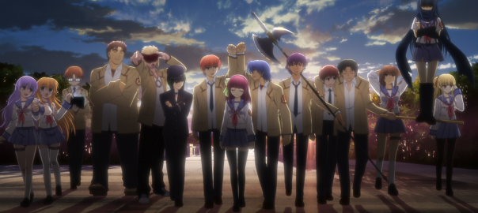

Hello !

Ça faisait longtemps que j’avais pas parlé d’un anime (ou tout court d’ailleurs) et le sujet du jour sera : **Angel Beats!**, un light novel devenu manga devenu anime, comme d’habitude pour les séries courtes en fait. Il a été écrit par l’auteur de _Clannad_ soit dit en passant. L’autre jour, j’ai été agréablement surpris en découvrant cet anime. **Ça faisait longtemps que je n’avais pas autant accroché et pourtant je suis pas difficile.** 😀

Angel Beats! est donc un anime en 13 épisodes + 1 OAV. Le premier épisode est très bizarre, on retrouve un jeune homme qui se réveille dans un monde après la mort sans avoir aucun souvenir de son vivant. Devant lui se tient une fille avec un sniper, Yurippe, qui tente d’abattre une autre fille toute kawaii, qui pourrait vous rappeler le personnage de Mashiro dans Sakurasou No Pet na Kanojo. Bonjour la logique. Elle lui explique qu’elle est le leader d’un groupe qui se bat pour la “survie” des élèves dans ce monde.

Ce monde n’est rien de plus banal qu’un lycée classique dans lequel évolue les personnages. Ces derniers tentent d’agir de façon décalée pour éviter la disparition qui est synonyme de réincarnation (et ils ont pas envie de se réincarner). L’intérêt de cet anime, outre le fait qu’il soit drôle (épisode 5 !), est l’évolution apportée au fil des épisodes. **On ne tombe jamais dans l’ennui** et chaque épisode est bien rythmé, mélangeant **comédie et drame**.

Ayant fini l’anime à ce jour, je vous le conseille vivement. 😀
