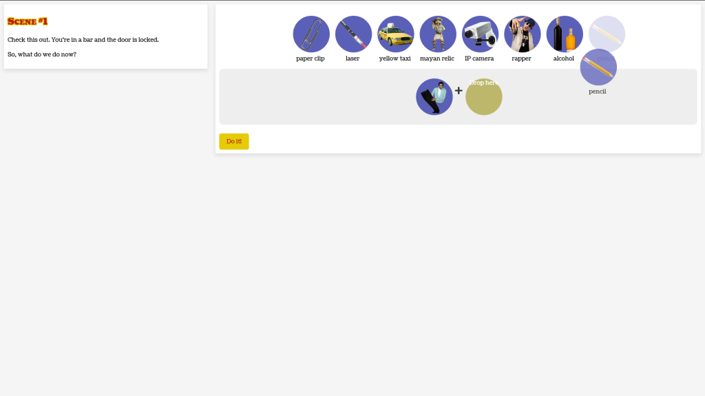
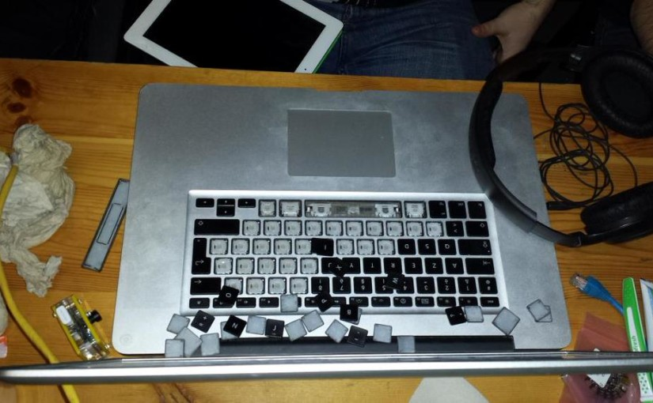

_Du 23 au 25 janvier dernier, c’était la Global Game Jam, **28 837 participants** et plus de **5438 jeux** créés dans 518 endroits dispersés entre 78 pays ! L’ouest de la France était un peu plus représenté cette année avec Nantes et Le Mans qui ont rejoint la partie. **Retour d’expérience pour ma 3ème année consécutive à Rennes.**_

Cette année, j’avais tout prévu, 1h de sommeil en plus chaque jour pour prévoir le coup de la nuit blanche qui tue. Le jour J est enfin arrivé et après quelques déambulations dans les bus de Rennes avec des bagages contenant de quoi dormir, l’oreiller étant l’élément principal, j’ai posé mes affaires au Jardin Moderne, prêt à coder.

Quelques retrouvailles des participants des années précédentes (coucou [Flavien](http://twitter.com/FlavienAuffret "@FlavienAuffret"), [Rémi](http://twitter.com/RemiMorillon "@RemiMorillon"), [Christopher](http://twitter.com/Egleek "@Egleek"), [Florent](http://twitter.com/Aeden_ "@Aeden_") et plein d’autres) puis la présentation a commencé ! Petite vidéo officielle présentant des développeurs parlant de leur passion… mais la vidéo dure 20 minutes, on a pas tout vu car on attendait le thème avec impatience. Enfin, il a été donné sous forme d’une vidéo dynamique jouant sur le suspens :

<iframe style="margin: auto; display: block;" width="560" height="315" src="http://www.youtube.com/embed/N1W5VxdNyNk" frameborder="0" allowfullscreen></iframe>

Et oui : **What do we do now ?** À la fois le thème et la question que nous nous sommes posées après cette annonce surprenante. Du coup, après quelques échanges, nous en sommes venus à **MacGyver : le roi de la débrouille, le Dieu de l’action dans l’instant**. La constitution de l’équipe s’est faite simplement : _Flavien_, à l’origine de l’idée, _Christopher_ et _moi_, prêts à délirer. _Florent_ nous a rejoint pendant l’événement après avoir mis en place les outils dont nous avons disposé : un serveur Git, un samba etc… en local.

Et nous voilà parti, les idées fusant les unes après les autres sans avoir concrètement de base de départ. Arrivé samedi midi, on avait bien déliré, mais on avait pas avancé ! Par contre, je peux vous donner tous les remix du thème de MacGyver qui est passé en boucle pendant la nuit.

<iframe style="margin: auto; display: block;" width="560" height="315" src="http://www.youtube.com/embed/PNl9M5TxGC8" frameborder="0" allowfullscreen></iframe>

Finalement, après un bon repas, **nous avons fait le choix de React.js** pour développer le bidule. Flavien nous avait déjà concocté un diplôme de la débrouille à gagner à la fin du jeu, il ne restait plus qu’une génération personnalisée grâce à jsPDF.

Concernant le jeu, il prend la forme d’un site web. Le principe du jeu est simple (un peu trop, mais on a pas eu trop le temps) : **un problème survient dans un lieu aléatoire et il vous suffit de choisir deux objets dans une liste générée aléatoirement pour le résoudre**. Pour le pitch de base : vous suivez un cursus à la DIY Academy et vous êtes amenés à affronter des problèmes de débrouille, alors suivez votre instinct pour devenir le prochain MacGyver !

Dans les améliorations possibles, on voulait générer une pièce en 2D avec les objets et que l’on puisse choisir chaque élément à composer.

Au niveau son, rien à redire, **5 sound designers sur place, c’était le rêve**. Il paraît même qu’ils ont aidés ceux de Nantes qui inaugurait leur première game jam officielle. Blow (désolé, j’ai oublié le prénom) s’est présenté à nous pour nous proposer du son et **ça envoie du pâté**, pourtant **on lui a demandé un truc moisi des années 80**.

À retenir de ce week-end : **deux renversement de café dans l’équipe**. D’abord moi, le PC a échappé de peu, samedi matin et Christopher dans la soirée qui a carrément renversé sur le clavier. Extinction ni une ni deux, arrachage des touches pour éponger et finalement, il était bon pour repartir ! Voilà un peu ce que ça donnait :

Le week-end s’est terminé, après une nuit blanche de samedi à dimanche, sur **une présentation mythique** qui a l’air d’avoir beaucoup plu au public. Cependant, on pourra toujours critiquer leurs choix d’objets quitte à rentrer dans le délire 😛

<iframe style="margin: auto; display: block;" width="560" height="315" src="http://www.youtube.com/embed/XqUWs8QsxRE" frameborder="0" allowfullscreen></iframe>

**Et enfin voici le fameux diplôme que vous pouvez gagner en jouant au jeu directement depuis votre navigateur à cette adresse : [DIY Academy](http://westindiecollective.github.io/GGJ2015 "DIY Academy : The MacGyver's School").**

Pour terminer sur une note bad-ass comme ce week-end, voici une image de MacGyver :

Pour plus d’infos, vous pouvez retrouver tout le projet sur le [site de la Global Game Jam](http://globalgamejam.org/2015/games/do-it-yourself-academy "Do It Yourself Academy sur GlobalGameJam.org") et pour le code, il est accessible sur [GitHub](https://github.com/westindiecollective/ggj2015 "Repository GGJ2015").
