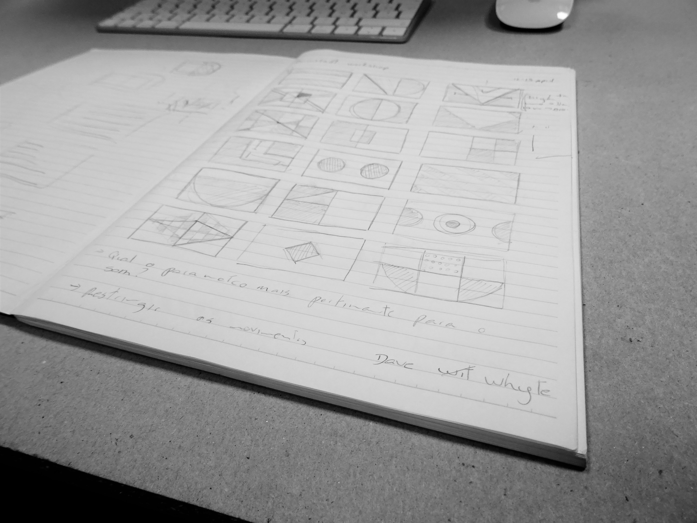
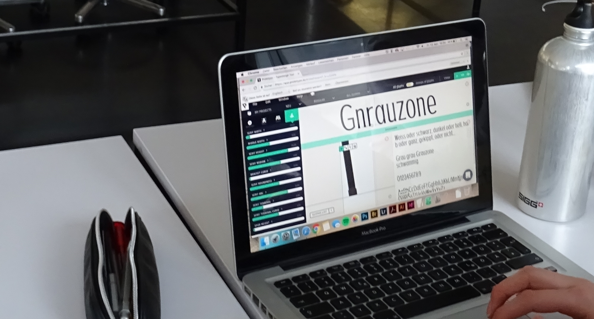
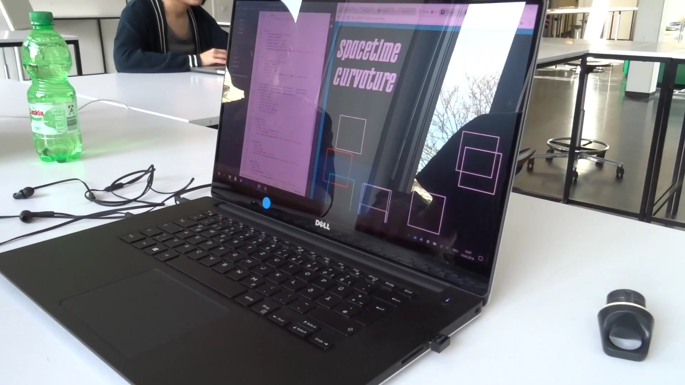
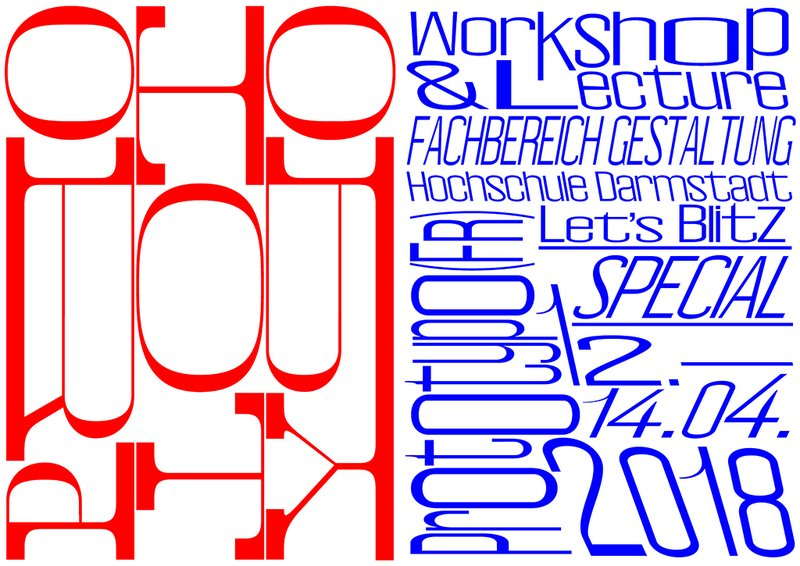

Hey everyone! A few months ago, on behalf of the company I work for, Prototypo, one of our designers, Pedro, and I headed to Germany! We held a 2-day workshop for the design faculty of Darmstadt.

We introduced eager students to our parametric technology and typefaces, while sharing our history of how parametric typefaces and Prototypo came to life. The next generation of designers sure asked us a bunch of interesting questions! We covered licenses, the app’s freedom of creation and how you can achieve the best outcome in a limited time.

The idea for the workshop was to first create a typeface in Prototypo that would be reused with the parametric font technology in the context of an animation. This would be then integrated using HTML and the animation feature of CSS3 inside a web page.

We prepared a few sketches and examples to inspire the students and give them a few ideas to start with: simple animations using squares, rectangles, circles... in combination with some flashy color backgrounds.

The workshop started on the Friday morning and, as expected, the students managed to master Prototypo quite easily. They started to refine their typeface on the very first day using different features like the manual editing.

The afternoon was a little more tricky, as we dived into coding. Applying an idea or a sketch into concrete logic is not an easy task, and as not everyone is familiar with coding, getting started was the real challenge. We started simple things using codepen.io, a really simple website that abstracts the hard part and gives you results very quickly.

The second day, we continued to refine the different compositions and integrated them in a pre-made ready-to-use project powered by Prototypo’s parametric font technology. With their pro account, students could directly import their font projects (created on Prototypo) into their animation. The only thing left to do was to explore the possibilities of the different inputs we could use (keyboard, sound...) and the different parameters we wanted to change according to these followings.

All in all, this workshop was a great experience! We’re happy to have had the opportunity to teach both type design and code. And we even had the chance to get back with cool posters made by the students!!

We hope everyone had a great time! If you’re interested in a workshop, don’t hesitate to send us an email at contact[at]prototypo.io!
